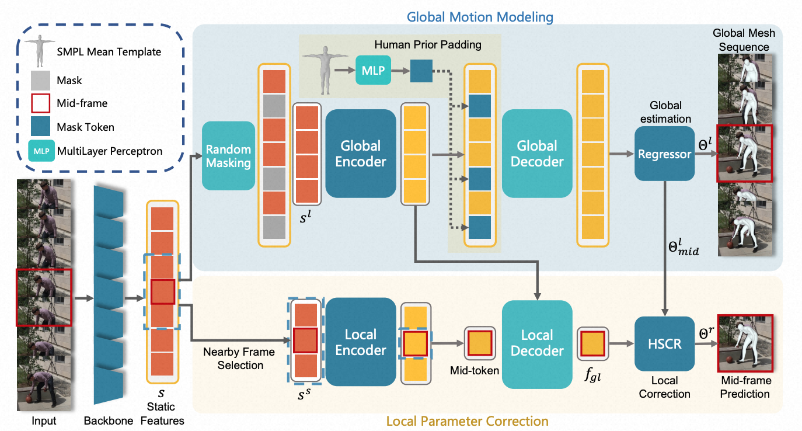
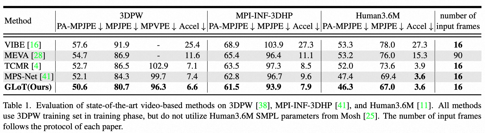
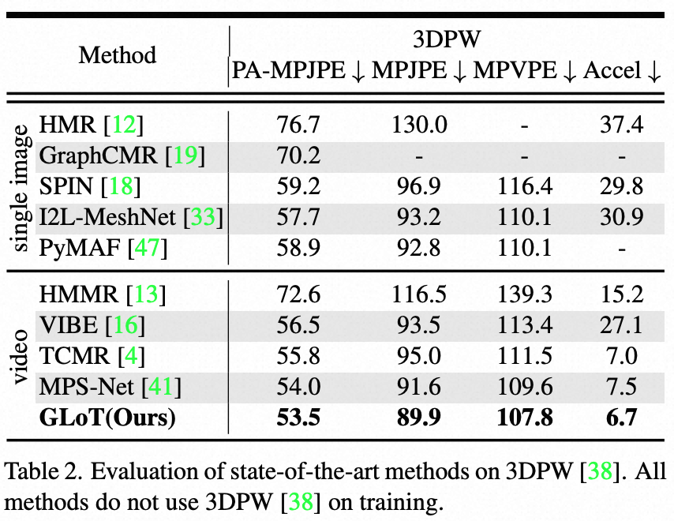

# GLoT: Global-to-Local Modeling for Video-based 3D Human Pose and Shape Estimation

## Introduction
This repository is the official [Pytorch](https://pytorch.org/) implementation of [Global-to-Local Modeling for Video-based 3D Human Pose and Shape Estimation](https://openaccess.thecvf.com/content/CVPR2023/papers/Shen_Global-to-Local_Modeling_for_Video-Based_3D_Human_Pose_and_Shape_Estimation_CVPR_2023_paper.pdf). 

The base codes are largely borrowed from [VIBE](https://github.com/mkocabas/VIBE) and [TCMR](https://github.com/hongsukchoi/TCMR_RELEASE).



See [our paper](https://openaccess.thecvf.com/content/CVPR2023/papers/Shen_Global-to-Local_Modeling_for_Video-Based_3D_Human_Pose_and_Shape_Estimation_CVPR_2023_paper.pdf) for more details.

## Results
Here I report the performance of GLoT.






## Running GLoT

## Installation
```bash
conda create -n glot python=3.7 -y
pip install torch==1.4.0 torchvision==0.5.0
pip install -r requirements.txt
```

### Data preparation
1. Download [base_data](https://drive.google.com/drive/folders/1PXWeHeo1e5gyXqLpEhIpatlNLd-8lpmc?usp=sharing) and SMPL pkl ([male&female](https://smpl.is.tue.mpg.de/) and [neutral](https://smplify.is.tue.mpg.de/)), and then put them into ${ROOT}/data/base_data/. Rename SMPL pkl as SMPL_{GENDER}.pkl format. For example, mv basicModel_neutral_lbs_10_207_0_v1.0.0.pkl SMPL_NEUTRAL.pkl.

2. Download [data](https://drive.google.com/drive/folders/1h0FxBGLqsxNvUL0J43WkTxp7WgYIBLy-?usp=sharing) provided by TCMR (except InstaVariety dataset). Pre-processed InstaVariety is uploaded by VIBE authors [here](https://owncloud.tuebingen.mpg.de/index.php/s/MKLnHtPjwn24y9C). Put them into ${ROOT}/data/preprocessed_data/

3. Download [models](https://drive.google.com/drive/folders/1PXWeHeo1e5gyXqLpEhIpatlNLd-8lpmc?usp=sharing) for testing. Put them into ${ROOT}/data/pretrained_models/

4. Download images (e.g., [3DPW](https://virtualhumans.mpi-inf.mpg.de/3DPW/)) for rendering. Put them into ${ROOT}/data/3dpw/

The data directory structure should follow the below hierarchy.
```
${ROOT}  
|-- data  
  |-- base_data  
    |-- J_regressor_extra.npy  
    |-- ...
  |-- preprocessed_data
    |-- 3dpw_train_db.pt
    |-- ...
  |-- pretrained_models
    |-- table1_3dpw_weights.pth.tar
    |-- ...
  |-- 3dpw
    |-- imageFiles
      |-- courtyard_arguing_00
      |-- ...
```

### Evaluation

- Run the evaluation code with a corresponding config file to reproduce the performance in the tables of [our paper](https://openaccess.thecvf.com/content/CVPR2023/papers/Shen_Global-to-Local_Modeling_for_Video-Based_3D_Human_Pose_and_Shape_Estimation_CVPR_2023_paper.pdf).
```bash
# Table1 3dpw
python evaluate.py --dataset 3dpw --cfg ./configs/repr_table1_3dpw.yaml --gpu 0 
# Table1 h36m
python evaluate.py --dataset h36m --cfg ./configs/repr_table1_h36m_mpii3d.yaml --gpu 0
# Table1 mpii3d
python evaluate.py --dataset mpii3d --cfg ./configs/repr_table1_h36m_mpii3d.yaml --gpu 0

# Table2 3dpw
python evaluate.py --dataset 3dpw --cfg ./configs/repr_table2_3dpw.yaml --gpu 0 

# for rendering 
python evaluate.py --dataset 3dpw --cfg ./configs/repr_table1_3dpw.yaml --gpu 0 --render
```
### Reproduction (Training)

- Run the training code with a corresponding config file to reproduce the performance in the tables of [our paper](https://openaccess.thecvf.com/content/CVPR2023/papers/Shen_Global-to-Local_Modeling_for_Video-Based_3D_Human_Pose_and_Shape_Estimation_CVPR_2023_paper.pdf).
```bash
# Table1 3dpw
python train_cosine_trans.py --cfg ./configs/repr_table1_3dpw.yaml --gpu 0 

# Table1 h36m & mpii3d
python train_cosine_trans.py --cfg ./configs/repr_table1_h36m_mpii3d.yaml --gpu 0 

# Table2 3dpw
python train_cosine_trans.py --cfg ./configs/repr_table2_3dpw.yaml --gpu 0 
```
- After the training, change the config file's `TRAIN.PRETRAINED` with the checkpoint path (either `checkpoint.pth.tar` or `model_best.pth.tar`) and follow the evaluation command.

## Quick demo
- Download your videos, and run the following command.
```bash
python demo.py --vid_file demo.mp4 --gpu 0 --cfg ./configs/repr_table1_3dpw.yaml 
```
- The results will be saved in ./demo_output/demo/
## Reference
```
@inproceedings{shen2023global,
  title={Global-to-Local Modeling for Video-based 3D Human Pose and Shape Estimation},
  author={Shen, Xiaolong and Yang, Zongxin and Wang, Xiaohan and Ma, Jianxin and Zhou, Chang and Yang, Yi},
  booktitle={Proceedings of the IEEE/CVF Conference on Computer Vision and Pattern Recognition},
  pages={8887--8896},
  year={2023}
}
```

## License
This project is licensed under the terms of the MIT license.